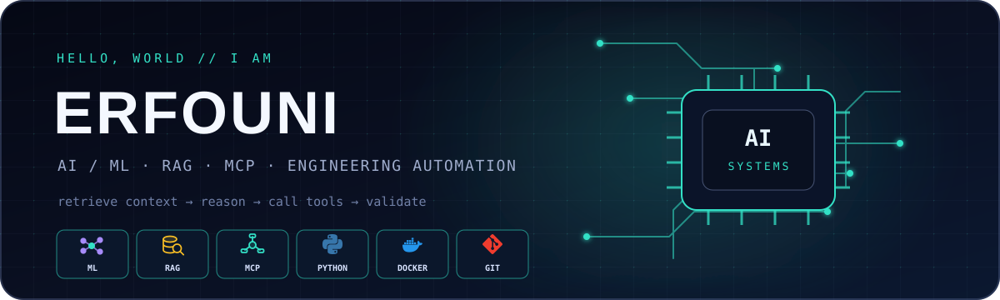

<div align="center">

  

  <br />

  

</div>

## `> whoami`

I'm **Erfouni**, an AI/ML builder interested in systems that do more than generate text—they retrieve useful context, call tools, automate workflows, and produce real-world results.

- 🧠 Building with **machine learning, RAG, and agentic workflows**
- 🔌 Connecting models to tools and knowledge through **MCP and REST APIs**
- 🐳 Packaging ideas with **Python and Docker**
- ⚙️ Exploring **AI-assisted CAD and SolidWorks automation**
- 🧪 Current operating mode: _prototype → test → break → learn → ship_

## `> stack --verbose`

<div align="center">

### AI & intelligent systems


### Code, containers & tools


### Engineering meets AI


</div>

## `> ls ./what-i-build`

| System | What makes it interesting |
|:--|:--|
| 🧠 **AI knowledge systems** | Retrieval pipelines that give models the right context before they answer |
| 🔌 **Tool-using agents** | MCP and API integrations that let AI take useful, controlled action |
| ⚙️ **Engineering automation** | Intelligent workflows for CAD, design rules, and technical knowledge |
| 📦 **Reproducible services** | Python applications packaged to behave the same way outside my laptop |

## `> cat featured_build.md`

### SolidWorks Design Assistant

I'm contributing to a Claude Code plugin that connects AI-assisted SolidWorks workflows to a curated engineering knowledge base through MCP.

[](https://github.com/mesutfd/solidworks-claude-plugin)

```text
design request
    └──► retrieve standards + known patterns
              └──► reason with constraints
                        └──► call CAD tools
                                  └──► validate → learn → improve
```

## `> ./runtime_diagnostics.py`

```python
def build_idea(idea):
    while not idea.works:
        idea = debug(idea, coffee=True)
    return dockerize(idea)

# "Works on my machine" is a bug report, not a deployment strategy.
```

## `> github-stats --live`

<div align="center">

  
  

</div>

## `> ./contribution_snake --watch`

<div align="center">

  <picture>
    <source media="(prefers-color-scheme: dark)" srcset="https://raw.githubusercontent.com/Erfouni/Erfouni/output/github-contribution-grid-snake-dark.svg" />
    <source media="(prefers-color-scheme: light)" srcset="https://raw.githubusercontent.com/Erfouni/Erfouni/output/github-contribution-grid-snake.svg" />
    
  </picture>

  <sub>Feeding the snake one commit at a time.</sub>

</div>

---

<div align="center">

  <sub>Always learning. Occasionally debugging the debugger.</sub>

</div>
