<div align="center">

  

  <br />

  

  <br />

  [](https://docs.github.com/en/get-started/exploring-integrations/about-building-integrations)
  [](https://github.com/Erfouni/solidworks-GPT-plugin)

</div>

## `> whoami`

I'm **Erfouni**, an AI/ML builder interested in systems that do more than generate text—they retrieve useful context, call tools, automate workflows, validate outcomes, and produce real-world results.

- 🧠 Building with **machine learning, RAG, and agentic workflows**
- 🔌 Connecting models to tools and knowledge through **MCP and REST APIs**
- 🐳 Packaging ideas with **Python and Docker**
- ⚙️ Exploring **AI-assisted CAD and SolidWorks automation**
- 🧪 Current operating mode: _prototype → test → break → learn → ship_

<!-- open-source-impact:start -->

## `> contributions --merged`

<a href="https://github.com/search?q=author%3AErfouni+is%3Apr+is%3Amerged+-user%3AErfouni&type=pullrequests">
  <picture>
    <source media="(max-width: 600px) and (prefers-color-scheme: dark)" srcset="./assets/contributions/impact-mobile-dark.svg" />
    <source media="(max-width: 600px)" srcset="./assets/contributions/impact-mobile-light.svg" />
    <source media="(prefers-color-scheme: dark)" srcset="./assets/contributions/impact-dark.svg" />
    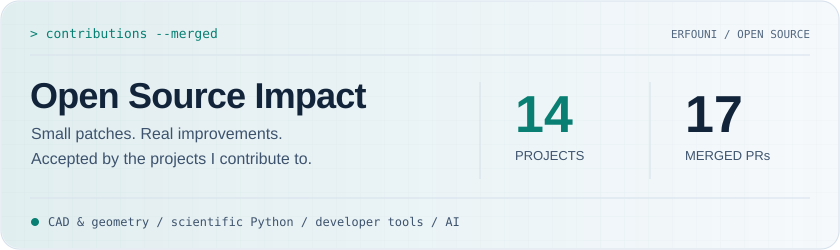
  </picture>
</a>

<p align="center">Contributions accepted upstream. Select a card to inspect the merged work.</p>

<p align="center">
  <a href="https://github.com/gumyr/build123d/pull/1489">
    <picture>
    <source media="(prefers-color-scheme: dark)" srcset="./assets/contributions/gumyr--build123d-dark.svg" />
    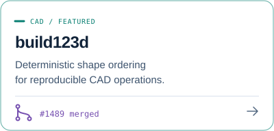
  </picture>
  </a>
  <a href="https://github.com/mikedh/trimesh/pull/2619">
    <picture>
    <source media="(prefers-color-scheme: dark)" srcset="./assets/contributions/mikedh--trimesh-dark.svg" />
    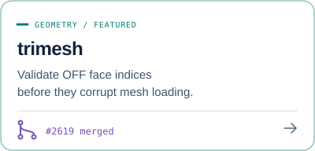
  </picture>
  </a>
  <a href="https://github.com/mozman/ezdxf/pulls?q=is%3Apr+is%3Amerged+author%3AErfouni">
    <picture>
    <source media="(prefers-color-scheme: dark)" srcset="./assets/contributions/mozman--ezdxf-dark.svg" />
    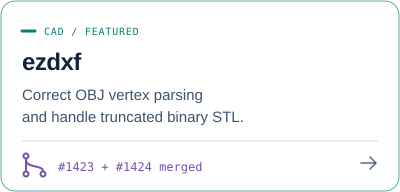
  </picture>
  </a>
  <a href="https://github.com/pycollada/pycollada/pull/165">
    <picture>
    <source media="(prefers-color-scheme: dark)" srcset="./assets/contributions/pycollada--pycollada-dark.svg" />
    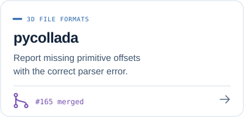
  </picture>
  </a>
  <a href="https://github.com/dranjan/python-plyfile/pull/91">
    <picture>
    <source media="(prefers-color-scheme: dark)" srcset="./assets/contributions/dranjan--python-plyfile-dark.svg" />
    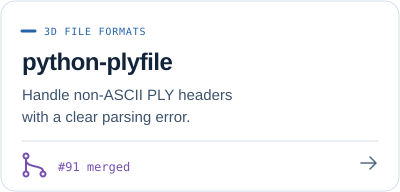
  </picture>
  </a>
  <a href="https://github.com/mathandy/svgpathtools/pull/253">
    <picture>
    <source media="(prefers-color-scheme: dark)" srcset="./assets/contributions/mathandy--svgpathtools-dark.svg" />
    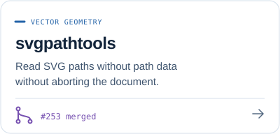
  </picture>
  </a>
  <a href="https://github.com/fonttools/fonttools/pull/4254">
    <picture>
    <source media="(prefers-color-scheme: dark)" srcset="./assets/contributions/fonttools--fonttools-dark.svg" />
    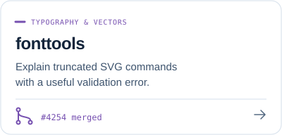
  </picture>
  </a>
  <a href="https://github.com/nipy/nibabel/pull/1573">
    <picture>
    <source media="(prefers-color-scheme: dark)" srcset="./assets/contributions/nipy--nibabel-dark.svg" />
    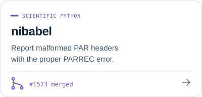
  </picture>
  </a>
  <a href="https://github.com/eea/odfpy/pulls?q=is%3Apr+is%3Amerged+author%3AErfouni">
    <picture>
    <source media="(prefers-color-scheme: dark)" srcset="./assets/contributions/eea--odfpy-dark.svg" />
    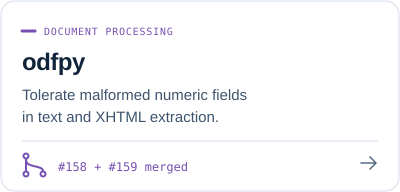
  </picture>
  </a>
  <a href="https://github.com/andorthehood/8f4e/pull/1059">
    <picture>
    <source media="(prefers-color-scheme: dark)" srcset="./assets/contributions/andorthehood--8f4e-dark.svg" />
    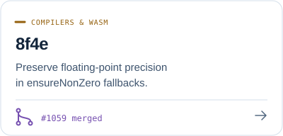
  </picture>
  </a>
  <a href="https://github.com/flint-fyi/flint/pulls?q=is%3Apr+is%3Amerged+author%3AErfouni">
    <picture>
    <source media="(prefers-color-scheme: dark)" srcset="./assets/contributions/flint-fyi--flint-dark.svg" />
    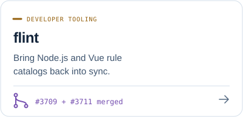
  </picture>
  </a>
  <a href="https://github.com/CallMeJones/blender-agent-bridge/pull/7">
    <picture>
    <source media="(prefers-color-scheme: dark)" srcset="./assets/contributions/callmejones--blender-agent-bridge-dark.svg" />
    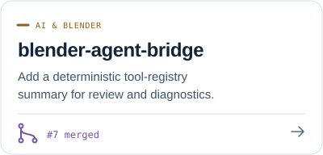
  </picture>
  </a>
  <a href="https://github.com/whut09/Awesome-AI-Engineering-Agents/pull/2">
    <picture>
    <source media="(prefers-color-scheme: dark)" srcset="./assets/contributions/whut09--awesome-ai-engineering-agents-dark.svg" />
    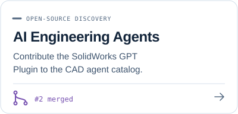
  </picture>
  </a>
  <a href="https://github.com/hashgraph-online/awesome-codex-plugins/pull/313">
    <picture>
    <source media="(prefers-color-scheme: dark)" srcset="./assets/contributions/hashgraph-online--awesome-codex-plugins-dark.svg" />
    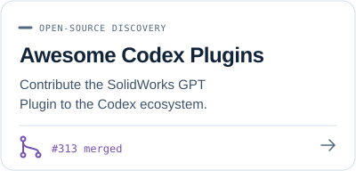
  </picture>
  </a>
</p>

<p align="center"><a href="https://github.com/search?q=author%3AErfouni+is%3Apr+is%3Amerged+-user%3AErfouni&type=pullrequests">Explore all merged contributions ↗</a></p>

<!-- open-source-impact:end -->

## `> stack --verbose`

<div align="center">

### AI & intelligent systems


### Code, containers & tools


### Engineering meets AI


</div>

## `> ls ./what-i-build`

| System | What makes it interesting |
|:--|:--|
| 🧠 **AI knowledge systems** | Retrieval pipelines that give models the right context before they answer |
| 🔌 **Tool-using agents** | MCP and API integrations that let AI take useful, controlled action |
| ⚙️ **Engineering automation** | Intelligent workflows for CAD, design rules, and technical knowledge |
| 📦 **Reproducible services** | Python applications packaged to behave the same way outside my laptop |

## `> cat featured_build.md`

### Knowledge-backed engineering agents

I build OpenAI Codex plugins and MCP systems that connect AI-assisted SolidWorks workflows to curated engineering knowledge, deterministic validation, and consent-based learning.

[](https://github.com/Erfouni/solidworks-GPT-plugin)
[](https://github.com/Erfouni/solidworks-drawing-api-2026)
[](https://github.com/Erfouni/connect-gpt-to-all-models-with-openrouter)
[](https://github.com/Erfouni/helios-llm-orchestrator)

```text
design request
    └──► retrieve standards + known patterns
              └──► reason with constraints
                        └──► call CAD tools
                                  └──► validate → learn → improve
```

## `> verify --shipped`

| Project | Inspectable proof | Why it belongs here |
|:--|:--|:--|
| **[SolidWorks GPT Plugin](https://github.com/Erfouni/solidworks-GPT-plugin)** | [](https://github.com/Erfouni/solidworks-GPT-plugin/releases/latest) [](https://github.com/Erfouni/solidworks-GPT-plugin/actions/workflows/validate.yml) | A knowledge-backed Codex plugin with deterministic validation, install verification, and versioned releases |
| **[Drawing API Database 2026](https://github.com/Erfouni/solidworks-drawing-api-2026)** | [](https://github.com/Erfouni/solidworks-drawing-api-2026/releases/latest) [](https://github.com/Erfouni/solidworks-drawing-api-2026/actions/workflows/ci.yml) | 2,405 API members, 1,293 source-linked examples, 32 workflows, and bilingual FTS5 search in a validated SQLite artifact |
| **[OpenRouter MCP Orchestrator](https://github.com/Erfouni/connect-gpt-to-all-models-with-openrouter)** | [](https://github.com/Erfouni/connect-gpt-to-all-models-with-openrouter/actions/workflows/ci.yml) | A tested MCP bridge for orchestrating multiple model families through one tool surface |
| **[Helios Multi-LLM Orchestrator](https://github.com/Erfouni/helios-llm-orchestrator)** | [](https://github.com/Erfouni/helios-llm-orchestrator/actions/workflows/ci.yml) | A local-first MCP orchestrator with task decomposition, official-source benchmark routing, 22 unit and HTTP integration tests, and cross-platform setup |

<sub>No vanity counters here—each status links to code, tests, or a release you can inspect.</sub>

## `> ./runtime_diagnostics.py`

```python
def build_idea(idea):
    while not idea.works:
        idea = debug(idea, coffee=True)
    return dockerize(idea)

# "Works on my machine" is a bug report, not a deployment strategy.
```

## `> ./pacman --eat-contributions`

<div align="center">

  <picture>
    <source media="(prefers-color-scheme: dark)" srcset="https://raw.githubusercontent.com/Erfouni/Erfouni/output/pacman-contribution-graph-dark.svg" />
    <source media="(prefers-color-scheme: light)" srcset="https://raw.githubusercontent.com/Erfouni/Erfouni/output/pacman-contribution-graph.svg" />
    
  </picture>

  <sub>Waka waka — one contribution at a time.</sub>

</div>

---

<div align="center">

  <sub>Always learning. Occasionally debugging the debugger.</sub>

</div>
